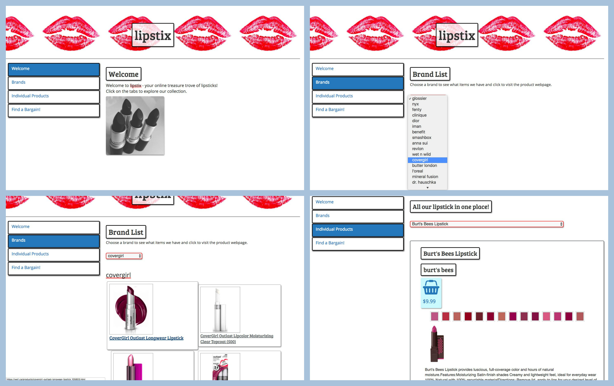
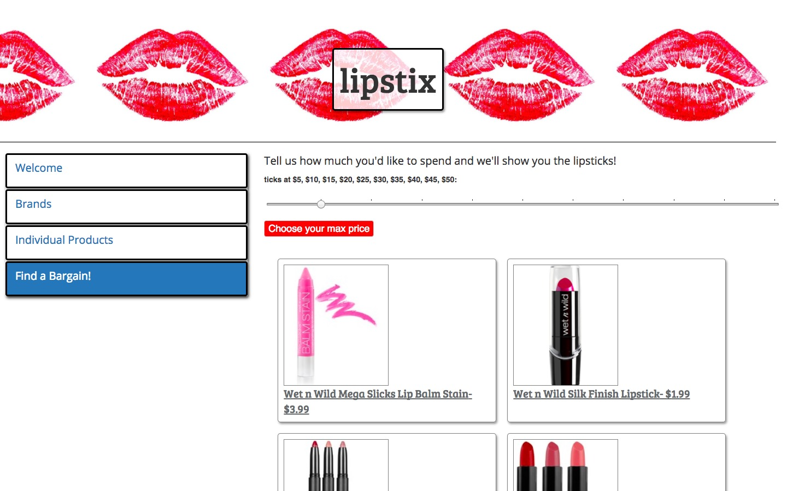

# makeupAppReact
One-Day Project: React App with Lodash, React-Bootstrap and API

***

***
* A one-page web app with React, using React-Bootstrap to provide illusion of multiple pages through tabs.
* Lodash used to manipulate data from https://makeup-api.herokuapp.com/
* Extras from Google Fonts, FontAwesome and Unsplash.
* HTML5 elements (input-type 'range') and CSS3 transitions for effects.

